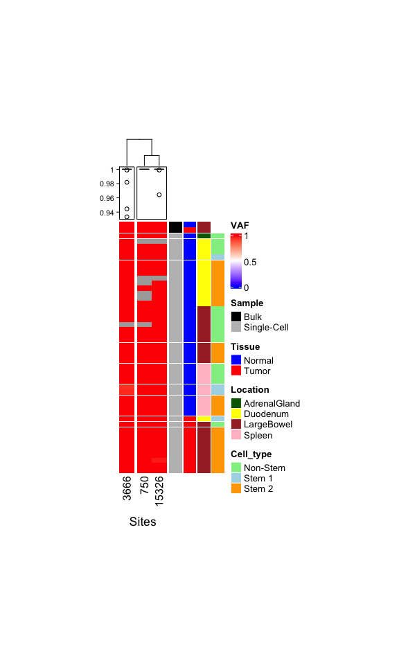

CRC01
================

# Needed packages

``` r
suppressPackageStartupMessages(library(ade4))
suppressPackageStartupMessages(library(tidyverse))
suppressPackageStartupMessages(library(pegas))
suppressPackageStartupMessages(library(data.table))
suppressPackageStartupMessages(library(ComplexHeatmap))
suppressPackageStartupMessages(library(circlize))
suppressPackageStartupMessages(library(zoo))
```

# VAF Plot:

``` r
VAF <- fread(file=here::here("data/CRC01_Bulk_and_MT_PASS_VAF.FIXED"),header = T,drop = 1,colClasses = c("character",rep("numeric",3))) #numeric: CRC01=3 , CRC07=16 , CRC08=23 , CRC12=20
popdata <- read.table(here::here("data/CRC01_group_FIXED_noLgr5.list"), h=T, sep="\t")
```

``` r
color_anno = list( Sample = c("Bulk"="black", "Single-Cell"="grey"), #Change as needed
                   Tissue = c("Tumor"="red", "Normal"="blue"),
                   Location = c("LargeBowel"="brown", "Spleen"="pink", "Duodenum"="yellow", "AdrenalGland"="darkgreen"),
                   Cell_type = c("Non-Stem 1"="lightblue", "Non-Stem 2"="lightgreen", "Stem"="orange", "ND"="white")
)

ha1 <- rowAnnotation(df = popdata[,-1], col = color_anno, show_annotation_name = F, na_col = "white")
ha2 <- HeatmapAnnotation(VAF= anno_boxplot(VAF), gp=gpar(pch=21, cex=0.5), show_annotation_name = F)
ht2 <- Heatmap(as.matrix(VAF), name= "VAF", cluster_rows = F, cluster_columns = T, top_annotation = ha2, column_split = 2,
               row_split = popdata[,-1], row_title = NULL, row_gap = unit(0.2,"mm"), col=colorRamp2(c(0,0.5,1), c("blue", "white", "red")),
               right_annotation = ha1, na_col = "darkgrey", column_title = "Sites", column_title_side = "bottom", width=ncol(as.matrix(VAF))*unit(6,"mm"), height=nrow(as.matrix(VAF))*unit(2,"mm"))
ht2
```

<!-- -->
