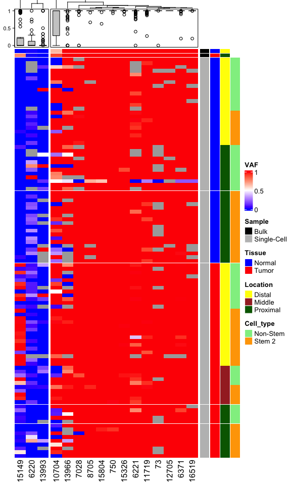
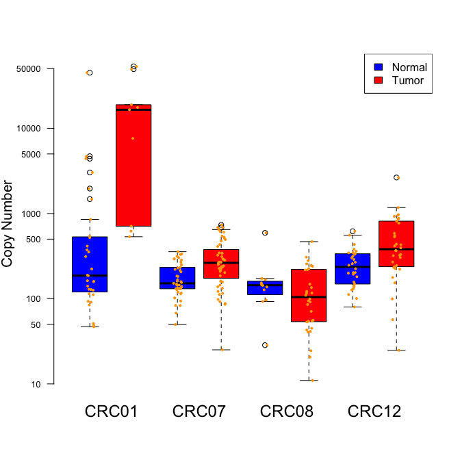
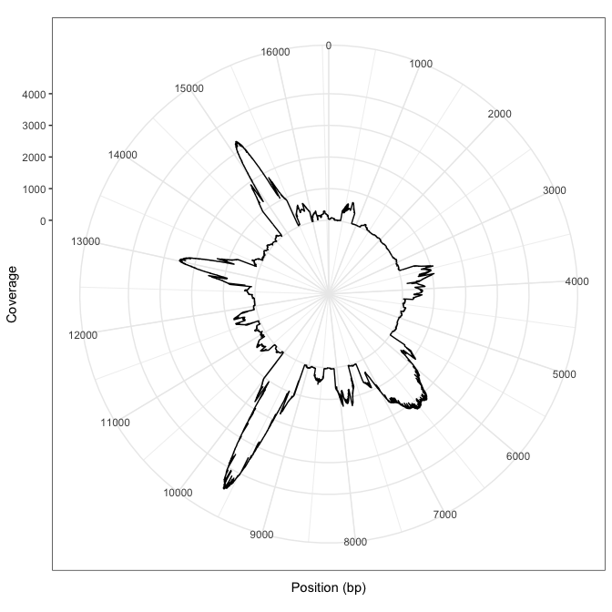
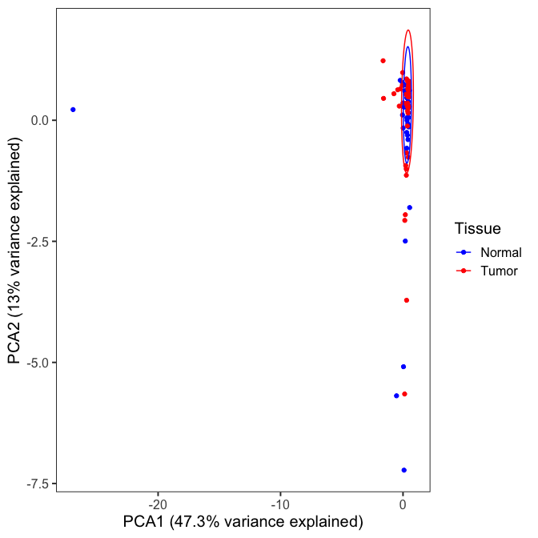
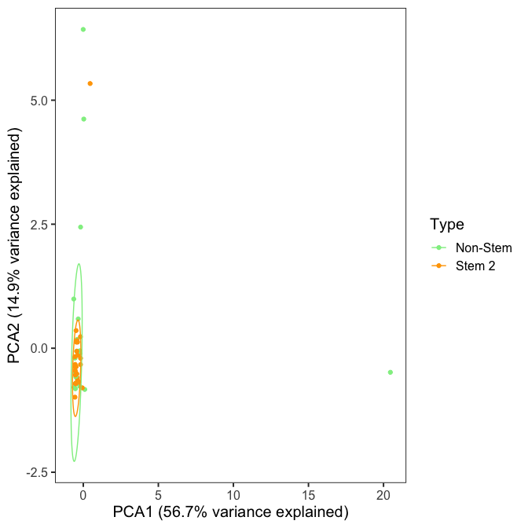
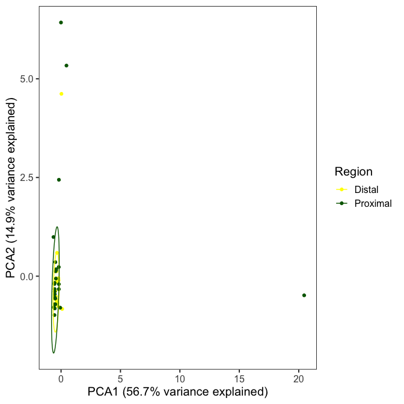
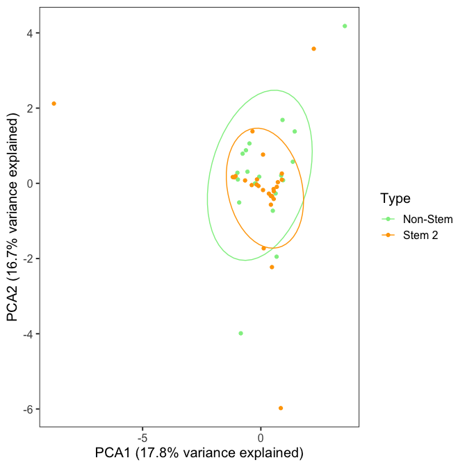
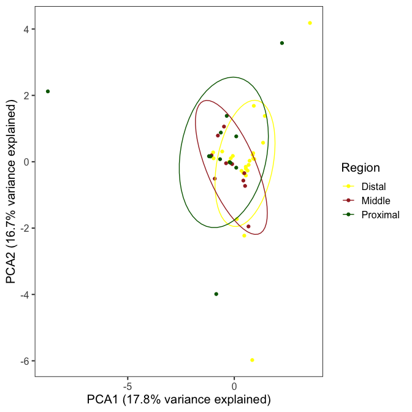

CRC07
================

# Needed packages

``` r
suppressPackageStartupMessages(library(ade4))
suppressPackageStartupMessages(library(tidyverse))
suppressPackageStartupMessages(library(pegas))
suppressPackageStartupMessages(library(data.table))
suppressPackageStartupMessages(library(ComplexHeatmap))
suppressPackageStartupMessages(library(circlize))
suppressPackageStartupMessages(library(zoo))
```

# VAF Plot:

``` r
VAF <- fread(file=here::here("data/CRC07_Bulk_and_MT_PASS_VAF.FIXED"),header = T,drop = 1,colClasses = c("character",rep("numeric",16))) #numeric: CRC01=3 , CRC07=16 , CRC08=23 , CRC12=20
popdata <- read.table(here::here("data/CRC07_group_FIXED_noLgr5.list"), h=T, sep="\t")
```

``` r
color_anno = list( Sample = c("Bulk"="black", "Single-Cell"="grey"), #Change as needed
                   Tissue = c("Tumor"="red", "Normal"="blue"),
                   Location = c("Central"="brown", "Middle"="brown", "Distal"="yellow", "Proximal"="darkgreen"),
                   Cell_type = c("Non-Stem 1"="lightblue", "Non-Stem 2"="lightgreen", "Stem"="orange", "ND"="white")
)

ha1 <- rowAnnotation(df = popdata[,-1], col = color_anno, show_annotation_name = F, na_col = "white")
ha2 <- HeatmapAnnotation(VAF= anno_boxplot(VAF), gp=gpar(pch=21, cex=0.5), show_annotation_name = F)
ht2 <- Heatmap(as.matrix(VAF), name= "VAF", cluster_rows = F, cluster_columns = T, top_annotation = ha2, column_split = 2,
               row_split = popdata[,-1], row_title = NULL, row_gap = unit(0.2,"mm"), col=colorRamp2(c(0,0.5,1), c("blue", "white", "red")),
               right_annotation = ha1, na_col = "darkgrey", column_title = "Sites", column_title_side = "bottom", width=ncol(as.matrix(VAF))*unit(6,"mm"), height=nrow(as.matrix(VAF))*unit(2,"mm"))
ht2
```

<!-- -->

# AMOVA:

``` r
VAF <- fread(file=here::here("data/CRC07_Bulk_and_MT_PASS_VAF_SC.FIXED"),header = T,drop = 1,colClasses = c("character",rep("numeric",16))) #numeric: CRC01=3 , CRC07=16 , CRC08=23 , CRC12=20
nei <- function(a,b){
  na.index <- as.vector(is.na(a) | is.na(b)) #To avoid include NAs in calculations
  -log(purrr::map2(a[!na.index],b[!na.index], function(X,Y){
    X*Y + (1.0-X)*(1.0-Y)}) %>% unlist %>% 
      sum(na.rm = T) / sqrt( ( sum(a[!na.index]^2,na.rm = T)+sum((1.0-a[!na.index])^2,na.rm = T) ) * ( sum(b[!na.index]^2)+sum((1.0-b[!na.index])^2) ) ) )
}  
VAF <- as.matrix(VAF)
nei_dis <- apply(combn(1:nrow(VAF), 2), 2, function(X) nei(unlist(VAF[X[1],]), unlist(VAF[X[2],]))) #A dirty way to do this
if (sum(is.infinite(nei_dis)) > 0){
  # Correction for infinity values given in poppr::nei.distance
  # Inf values are replaced by 10*max(finite distance)
  nei_dis[is.infinite(nei_dis)] <- 10 * max(nei_dis[is.finite(nei_dis)])
}
DM <- matrix(0, nrow=nrow(VAF), ncol=nrow(VAF))
DM[lower.tri(DM, diag=F)] <- nei_dis
DM <- t(DM)
DM[lower.tri(DM, diag=F)] <- nei_dis
DM <- as.dist(DM)

popdata <- read.table(here::here("data/CRC07_group_FIXED_noLgr5_SC.list"), h=TRUE, sep="\t")
popdata$Tissue <- popdata$Tissue %>% as.factor()
popdata$Region <- popdata$Region %>% as.factor()
popdata$Type <- popdata$Type %>% as.factor()
hier_groups_labels <- c("Tissue", "Region by Tissue", "Cell type by Tissue")
hier_groups <- c("Tissue", "Tissue/Region", "Tissue/Type")
amv <- lapply(hier_groups, function(X){do.call("amova", list(as.formula(paste("DM ~",X)), data = as.name("popdata")))})
tab_pvalues <- tibble(Group=hier_groups_labels, p_values=sapply(amv,function(X){X$varcomp[nrow(X$varcomp)-1,2]}))
```

``` r
amv
```

    ## [[1]]
    ## 
    ##  Analysis of Molecular Variance
    ## 
    ## Call: amova(formula = DM ~ Tissue, data = popdata)
    ## 
    ##              SSD         MSD  df
    ## Tissue 0.1198367 0.119836673   1
    ## Error  0.6281483 0.006098528 103
    ## Total  0.7479850 0.007192164 104
    ## 
    ## Variance components:
    ##           sigma2 P.value
    ## Tissue 0.0021682       0
    ## Error  0.0060985        
    ## 
    ## Phi-statistics:
    ## Tissue.in.GLOBAL 
    ##        0.2622813 
    ## 
    ## Variance coefficients:
    ##        a 
    ## 52.45714 
    ## 
    ## 
    ## [[2]]
    ## 
    ##  Analysis of Molecular Variance
    ## 
    ## Call: amova(formula = DM ~ Tissue/Region, data = popdata)
    ## 
    ##                SSD          MSD  df
    ## Tissue  0.11983667  0.119836673   1
    ## Region -0.01580134 -0.015801341   1
    ## Error   0.64394968  0.006313232 102
    ## Total   0.74798502  0.007192164 104
    ## 
    ## Variance components:
    ##             sigma2 P.value
    ## Tissue  0.00662413        
    ## Region -0.00046686   0.001
    ## Error   0.00631323        
    ## 
    ## Phi-statistics:
    ## Tissue.in.GLOBAL (Phi_CT) Region.in.GLOBAL (Phi_ST) Region.in.Tissue (Phi_SC) 
    ##                0.53118421                0.49374681               -0.07985524 
    ## 
    ## Variance coefficients:
    ##        a        b        c 
    ## 47.36842 13.58396 18.09524 
    ## 
    ## 
    ## [[3]]
    ## 
    ##  Analysis of Molecular Variance
    ## 
    ## Call: amova(formula = DM ~ Tissue/Type, data = popdata)
    ## 
    ##                SSD         MSD  df
    ## Tissue  0.11983667 0.119836673   1
    ## Type   -0.08641113        -Inf   0
    ## Error   0.71455948 0.006937471 103
    ## Total   0.74798502 0.007192164 104
    ## 
    ## Variance components:
    ##           sigma2 P.value
    ## Tissue       NaN        
    ## Type         NaN        
    ## Error  0.0069375        
    ## 
    ## Phi-statistics:
    ## Tissue.in.GLOBAL (Phi_CT)   Type.in.GLOBAL (Phi_ST)   Type.in.Tissue (Phi_SC) 
    ##                       NaN                       NaN                       NaN 
    ## 
    ## Variance coefficients:
    ##   a   b   c 
    ## NaN NaN   0

# Pairwise:

## Tissue/Region

``` r
groups <- as.factor(paste(popdata$Tissue,popdata$Region,sep="_"))
ntt <- length(groups)
nDec <-4
for (i in 1:(ntt-1) ){
            for(j in seq(i+1,ntt ) ) {
                p1 <- which(groups==levels(groups)[i])
                p2 <- which(groups==levels(groups)[j])
                if(is_empty(p1) | is_empty(p2)) break
                ttos <- groups[c(p1,p2)]
                M <- as.dist(as.matrix(DM)[c(p1,p2),c(p1,p2)])
                a <- pegas::amova(M ~ ttos, nperm=10000)
                pval<-as.numeric(a$varcomp$P.value[1])
    
                pval<-ifelse(pval<0.0001, "(P<0.0001)", paste("(P=",format(pval, digits=nDec),")"))
                phiST <- as.numeric(a$varcomp[1,1]/(a$varcomp[1,1]+a$varcomp[2,1]))
                
                cat(levels(groups)[i], " - ",levels(groups)[j],": ",format(phiST,trim=T,digits=nDec),"\t ",pval," \n")
            }
        }
```

    ## Normal_Distal  -  Normal_Proximal :  -0.0284       (P= 0.6874 )  
    ## Normal_Distal  -  Tumor_Distal :  0.5552       (P<0.0001)  
    ## Normal_Distal  -  Tumor_Middle :  0.1937       (P= 0.0397 )  
    ## Normal_Distal  -  Tumor_Proximal :  -0.1291    (P= 0.9565 )  
    ## Normal_Proximal  -  Tumor_Distal :  0.4215     (P<0.0001)  
    ## Normal_Proximal  -  Tumor_Middle :  0.1656     (P= 0.06499 )  
    ## Normal_Proximal  -  Tumor_Proximal :  -0.05692     (P= 0.7856 )  
    ## Tumor_Distal  -  Tumor_Middle :  0.2096    (P= 0.0304 )  
    ## Tumor_Distal  -  Tumor_Proximal :  0.5309      (P<0.0001)  
    ## Tumor_Middle  -  Tumor_Proximal :  0.1965      (P= 0.0464 )

## Tissue/Type

``` r
groups <- as.factor(paste(popdata$Tissue,popdata$Type,sep="_"))
ntt <- length(groups)
nDec <-4
for (i in 1:(ntt-1) ){
            for(j in seq(i+1,ntt ) ) {
                p1 <- which(groups==levels(groups)[i])
                p2 <- which(groups==levels(groups)[j])
                if(is_empty(p1) | is_empty(p2)) break
                ttos <- groups[c(p1,p2)]
                M <- as.dist(as.matrix(DM)[c(p1,p2),c(p1,p2)])
                a <- pegas::amova(M ~ ttos, nperm=10000)
                pval<-as.numeric(a$varcomp$P.value[1])
    
                pval<-ifelse(pval<0.0001, "(P<0.0001)", paste("(P=",format(pval, digits=nDec),")"))
                phiST <- as.numeric(a$varcomp[1,1]/(a$varcomp[1,1]+a$varcomp[2,1]))
                
                cat(levels(groups)[i], " - ",levels(groups)[j],": ",format(phiST,trim=T,digits=nDec),"\t ",pval," \n")
            }
        }
```

    ## Normal_Non-Stem 2  -  Normal_Stem :  0.09019       (P= 0.0438 )  
    ## Normal_Non-Stem 2  -  Tumor_Non-Stem 2 :  0.2174       (P= 0.0012 )  
    ## Normal_Non-Stem 2  -  Tumor_Stem :  0.3563     (P<0.0001)  
    ## Normal_Stem  -  Tumor_Non-Stem 2 :  0.1526     (P= 0.0225 )  
    ## Normal_Stem  -  Tumor_Stem :  0.4032       (P<0.0001)  
    ## Tumor_Non-Stem 2  -  Tumor_Stem :  0.07761     (P= 0.07489 )

# Copy Number (fastmitocalc):

``` r
CRC <- read.table(here::here("data/CN_patient.txt"), header=T, sep="\t")
cols <- c("blue","red")
#pdf("CRC_TNCN.pdf")
boxplot(CN~Type+ID, data=CRC, at=c(1:2,3:4,5:6,7:8), col=cols, xlab="", ylab="Copy Number", log="y", yaxt="none", xaxt="none", frame=F, cex.lab=1.3)
legend("topright", fill=cols, legend = c("Normal","Tumor"))
axis(1, c("CRC01","","CRC07","","CRC08","","CRC12",""), at = (1:8) + 0.5, tick=F, cex.axis=1.5)
stripchart(CN~Type+ID, data=CRC, xlab="", ylab="Copy Number", log="y", yaxt="none", method="jitter", vertical=T, pch=21, cex=0.4, col="orange", bg="orange", add=T)
par(cex.axis=0.8)
axis(2,las=2)
```

<!-- -->

``` r
#dev.off()
```

# Coverage along mtDNA:

\#CRC07

``` r
a <- read.table(here::here("data/CRC07_Mean_Depth.txt"), header = T)
d <- data.frame(POS=a[,1], Means=rowMeans(a[,-1]))

ggplot(data=d, aes(x=POS, y=Means)) +
geom_line() + 
coord_polar() +
scale_y_continuous(limits=c(-0.5*max(d$Means), max(d$Means)), breaks=seq(0, max(d$Means), 1000)) + 
scale_x_continuous(limits=c(0, 16569), breaks=seq(0, 16569, 1000)) +
theme_bw() +
xlab("Position (bp)") +
ylab("Coverage")
```

<!-- -->

# PCA:

## CRC07:

## Normal+Tumor:

``` r
VAF <- fread(file=here::here("data/CRC07_Bulk_and_MT_PASS_VAF_SC.FIXED"),header = T,drop = 1,colClasses = c("character",rep("numeric",16))) #numeric: CRC01=3 , CRC07=16 , CRC08=23 , CRC12=20
popdata <- read.table(here::here("data/CRC07_group_FIXED_noLgr5_SC.list"), h=T, sep="\t")


cVAF <- apply(VAF,2, function(X){X[is.na(X)]<-median(X, na.rm=T); X},simplify = T) %>% as.data.frame

pca <- ade4::dudi.pca(df = cVAF, scannf=F, nf = 2)
```

## Tissue:

``` r
pca$li %>%
  ggplot(aes(x=Axis1, y=Axis2, color=popdata$Tissue))+
    geom_point()+
    stat_ellipse(level = 0.95) +
    theme_bw(base_size = 15) +
    labs(x=paste0("PCA1 (", round((pca$eig[1]/sum(pca$eig))*100,1), "% variance explained)"),
         y=paste0("PCA2 (", round((pca$eig[2]/sum(pca$eig))*100,1), "% variance explained)"),
         color="Tissue") +
    theme(panel.grid = element_blank()) + 
    scale_color_manual(values=c("Blue", "Red")) #Change as needed
```

<!-- -->

# Normal:

``` r
VAF <- fread(file=here::here("data/CRC07_Bulk_and_MT_PASS_VAF_SC_N.FIXED"),header = T,drop = 1,colClasses = c("character",rep("numeric",16))) #numeric: CRC01=3 , CRC07=16 , CRC08=23 , CRC12=20
popdata <- read.table(here::here("data/CRC07_group_FIXED_noLgr5_SC_N.list"), h=T, sep="\t")
cVAF <- apply(VAF,2, function(X){X[is.na(X)]<-median(X, na.rm=T); X},simplify = T) %>% as.data.frame
pca <- ade4::dudi.pca(df = cVAF, scannf=F, nf = 2) #nf is the number of pca axis for which the coordinates will be calculates
```

## Type of Normal cells:

``` r
pca$li %>%
  ggplot(aes(x=Axis1, y=Axis2, color=popdata$Type))+
    geom_point()+
    stat_ellipse(level = 0.95) +
    theme_bw(base_size = 15) +
    labs(x=paste0("PCA1 (", round((pca$eig[1]/sum(pca$eig))*100,1), "% variance explained)"),
         y=paste0("PCA2 (", round((pca$eig[2]/sum(pca$eig))*100,1), "% variance explained)"),
         color="Type")+
    theme(panel.grid = element_blank()) +
    scale_color_manual(values=c("lightgreen", "orange")) #Change as needed
```

<!-- -->

## Region of Normal cells:

``` r
pca$li %>%
  ggplot(aes(x=Axis1, y=Axis2, color=popdata$Region))+
    geom_point()+
    stat_ellipse(level = 0.95) +
    theme_bw(base_size = 15) +
    labs(x=paste0("PCA1 (", round((pca$eig[1]/sum(pca$eig))*100,1), "% variance explained)"),
         y=paste0("PCA2 (", round((pca$eig[2]/sum(pca$eig))*100,1), "% variance explained)"),
         color="Region")+
    theme(panel.grid = element_blank()) +
    scale_color_manual(values=c("yellow", "darkgreen")) #Change as needed
```

<!-- -->

# Tumor:

``` r
VAF <- fread(file=here::here("data/CRC07_Bulk_and_MT_PASS_VAF_SC_T.FIXED"),header = T,drop = 1,colClasses = c("character",rep("numeric",16))) #numeric: CRC01=3 , CRC07=16 , CRC08=23 , CRC12=20
popdata <- read.table(here::here("data/CRC07_group_FIXED_noLgr5_SC_T.list"), h=T, sep="\t")
cVAF <- apply(VAF,2, function(X){X[is.na(X)]<-median(X, na.rm=T); X},simplify = T) %>% as.data.frame
pca <- ade4::dudi.pca(df = cVAF, scannf=F, nf = 2) #nf is the number of pca axis for which the coordinates will be calculates
```

## Type of Tumor cells:

``` r
pca$li %>%
  ggplot(aes(x=Axis1, y=Axis2, color=popdata$Type))+
    geom_point()+
    stat_ellipse(level = 0.95) +
    theme_bw(base_size = 15) +
    labs(x=paste0("PCA1 (", round((pca$eig[1]/sum(pca$eig))*100,1), "% variance explained)"),
         y=paste0("PCA2 (", round((pca$eig[2]/sum(pca$eig))*100,1), "% variance explained)"),
         color="Type")+
    theme(panel.grid = element_blank()) +
    scale_color_manual(values=c("lightgreen", "orange")) #Change as needed
```

<!-- -->

## Region of Tumor cells:

``` r
pca$li %>%
  ggplot(aes(x=Axis1, y=Axis2, color=popdata$Region))+
    geom_point()+
    stat_ellipse(level = 0.95) +
    theme_bw(base_size = 15) +
    labs(x=paste0("PCA1 (", round((pca$eig[1]/sum(pca$eig))*100,1), "% variance explained)"),
         y=paste0("PCA2 (", round((pca$eig[2]/sum(pca$eig))*100,1), "% variance explained)"),
         color="Region")+
    theme(panel.grid = element_blank()) +
    scale_color_manual(values=c("yellow", "brown", "darkgreen")) #Change as needed
```

    ## Warning in MASS::cov.trob(data[, vars]): Probable convergence failure

<!-- -->
